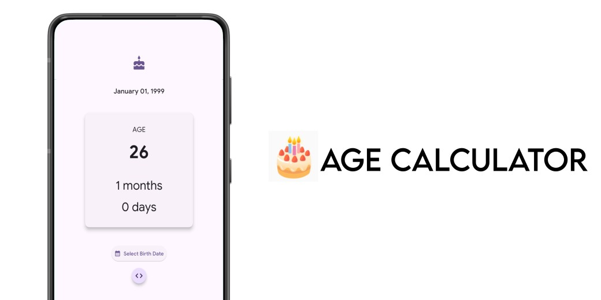
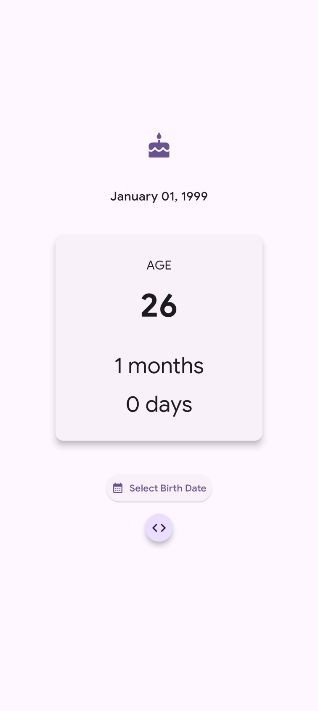
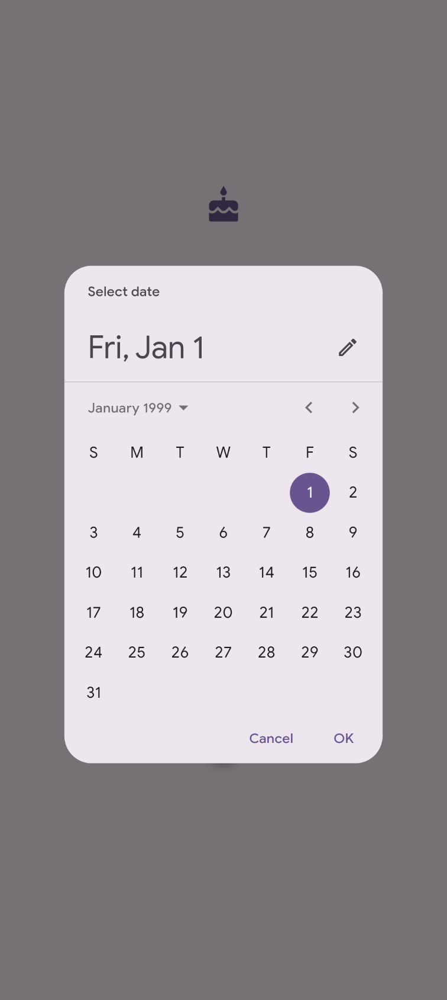

# 🎂 Age Calculator

[](https://python.org)
[](https://flet.dev)
[](https://opensource.org/licenses/MIT)
[](https://github.com/virendracarpenter/age-calculator-flet/releases)

A modern age calculator Android app built with Python and Flet Framework featuring Material You design.



## ✨ Features
- Material You dynamic color theming
- Calendar date picker widget
- Accurate age calculation (years, months, days)
- Clean minimalist UI
- GitHub integration button
- Responsive layout

## 📦 Devlopment Instructions

Follow these steps to set up and run the Age Calculator application locally on your machine .

### ✅ Prerequisites
- Python **3.9+** installed
- Recommended: Use a **virtual environment (venv)** to manage project dependencies

### 📂 Step 1: Clone Repository (or Save Files)the 

Create Project Directory:
```bash
cd age-calculator
pip install .
```

### ⚙️ Step 2: Set up the Environment

Activate the Virtual Environment:

- **macOS / Linux**:
  ```bash
  source .venv/bin/activate
  ```

- **Windows (Command Prompt)**:
  ```bash
  .venv\Scripts\activate.bat
  ```

- **Windows (PowerShell)**:
  ```bash
  .venv\Scripts\Activate.ps1
  ```

Install Dependencies:
```bash
pip install .
```

### ▶️ Step 3: Run the Application

Run in a **native desktop window**:
```bash
flet run main.py
```
Run as a **web app**:
```bash
flet run --web main.py
```
👉 The application will start in **hot reload mode**, meaning any saved changes to `main.py` will automatically update the running app instance.

## ⚠️ Troubleshooting Common Issues

| Issue | Description | Solution |
|-------|-------------|----------|
| **`command not found: flet`** | Flet CLI is not in your system's PATH | Ensure you have activated the virtual environment (Step 2) before running `flet run` |
| **`ImportError: No module named 'dateutil'`** | Dependency installation failed or environment inactive | Run `pip install -r requirements.txt` again while the venv is active |
| **App won't update (Hot Reload)** | Changes not reflecting in running app | Make sure you’re using `flet run main.py`. If issue persists, stop app (`Ctrl+C`) and restart |
| **`page.update()` errors** | Runtime errors related to updating controls | If running as web app, check browser console for detailed error messages |

---

## 🛠️ Configuration Notes

Since this is a standalone **Flet** application, there are no separate config files. All settings are controlled in **`main.py`**:

- **Theme**:  
  Material You theme is set using:
  ```python
  page.theme = ft.Theme(color_scheme_seed=ft.Colors.DEEP_PURPLE)
  ```
  Change `ft.Colors.DEEP_PURPLE` to another Flet color constant to customize.

- **Window Size**:  
  The application window size is fixed with:
  ```python
  page.window_width = 400
  page.window_height = 600
  ```
  Adjust values as needed.

---

## 📸 Screenshots

<div>
    
    
</div>
