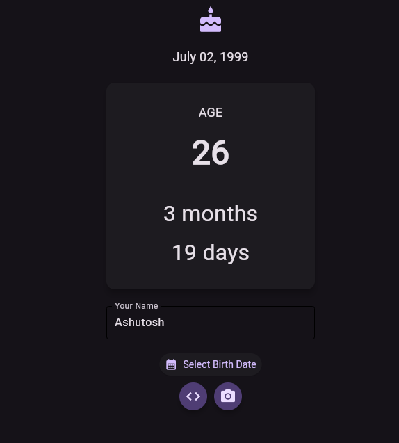

# 🎂 Age Calculator

[](https://python.org)
[](https://flet.dev)
[](https://opensource.org/licenses/MIT)
[](https://github.com/virendracarpenter/age-calculator-flet/releases)

A modern age calculator Android app built with Python and Flet Framework featuring Material You design.


## ✨ Features
- Material You dynamic color theming
- Calendar date picker widget
- Accurate age calculation (years, months, days)
- Clean minimalist UI
- GitHub integration button
- Responsive layout
- 

## 📦 Devlopment Installation
```bash
git clone https://github.com/virendracarpenter/age-calculator-flet.git
cd age-calculator-flet
pip install .
flet run
```

## 📸 Screenshots

<div>
    
    
</div>

## ✨ New Feature
Now you can generate Age card image and share it on different social media platform

### 📸 Screenshots
<div>
    
    
</div>

### 👨‍💻 Contributor
Ashutosh Agarwal (https://github.com/Ashutosh-agarwal2004)